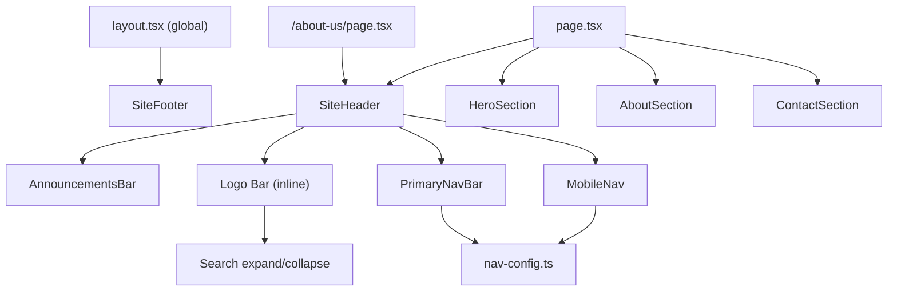
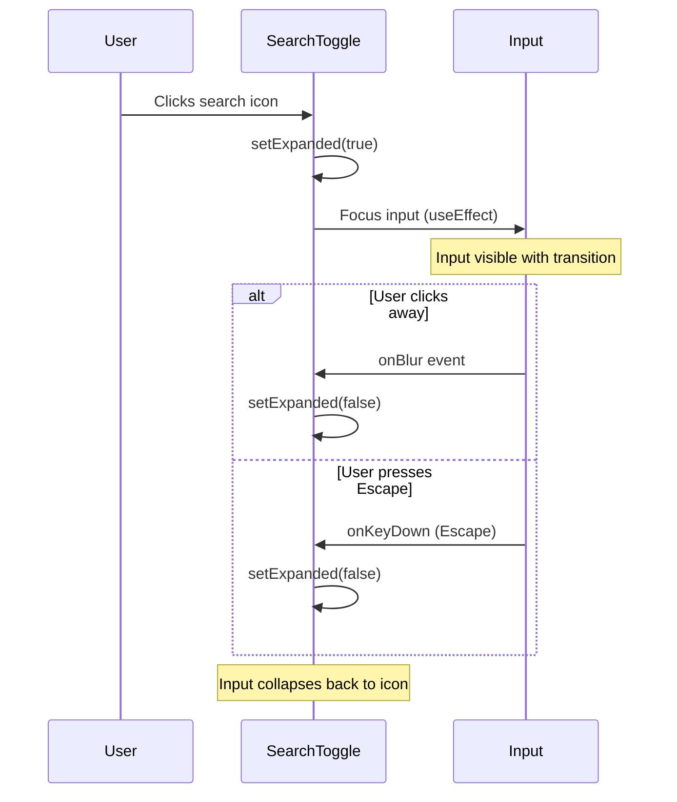
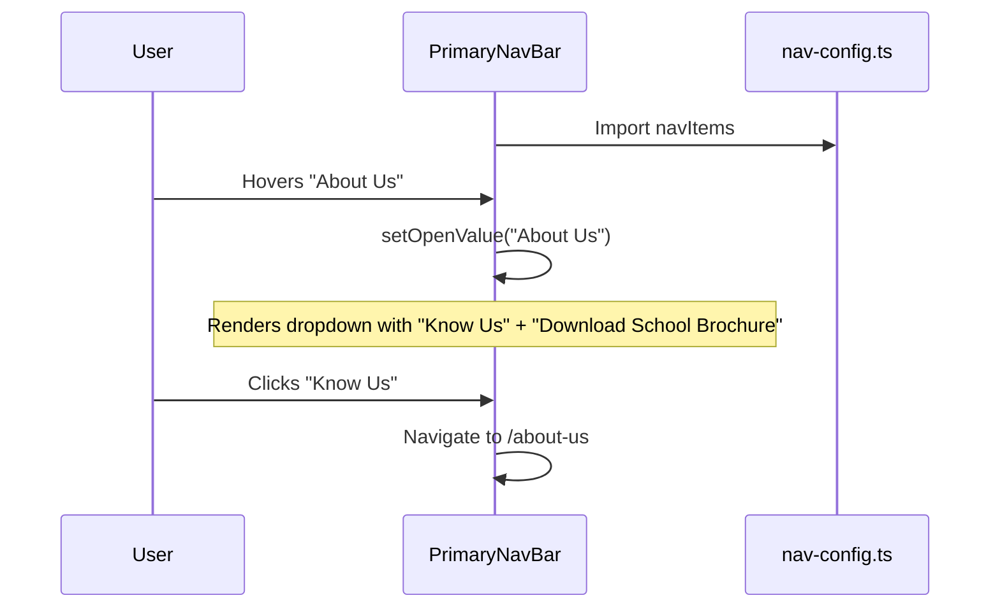

# Design Document: Apollo Website Redesign

## Overview

This design covers the redesign of the Apollo Vidhyalayam school website, modifying existing Next.js/Tailwind CSS components to match updated branding, navigation structure, hero messaging, contact information, and footer layout. A new `/about-us` page will be created. The primary changes are to the logo bar (with expandable search), simplified navigation configuration, hero section copy/images, contact details, footer structure, and about section enhancements.

## Architecture

The site uses Next.js App Router with a shared layout (`src/app/layout.tsx`) that renders the `SiteFooter` globally. Each page renders `SiteHeader` at the top. Components live in `src/components/` and share a navigation configuration from `nav-config.ts`.



## Components and Interfaces

### Component 1: Logo Bar (within `site-header.tsx`)

**Purpose**: Displays school logo, name, search icon with expandable input, and action buttons.

**Current State**: Renders a placeholder square with "S", generic school name, and "Contact Us" + "Apply Now" buttons.

**Changes**:
- Replace placeholder square with `<Image src="/apollo-logo.jpg" ... />`
- Change school name to "Apollo Vidhyalayam" with subtitle "CBSE • Aragonda • Excellence"
- Remove "Contact Us" button
- Add "Parent Login" and "Teacher Login" outline buttons
- Keep "Apply Now" button
- Add a `SearchToggle` client component for expand/collapse search

**Interface**:
```typescript
// New client component for search expand/collapse
"use client";
interface SearchToggleProps {
  className?: string;
}

function SearchToggle({ className }: SearchToggleProps) {
  const [expanded, setExpanded] = useState(false);
  const inputRef = useRef<HTMLInputElement>(null);
  // expand on click, collapse on blur/Escape
}
```

**Data Flow — Search Expand/Collapse**:
- State is local to `SearchToggle` (no global state needed)
- `expanded: boolean` controls whether the input is visible
- Clicking the search icon sets `expanded = true` and focuses the input
- The input's `onBlur` event sets `expanded = false`
- Pressing Escape also sets `expanded = false`
- The transition uses Tailwind width/opacity classes for smooth animation

### Component 2: Navigation Config (`nav-config.ts`)

**Purpose**: Defines the navigation items consumed by `PrimaryNavBar` and `MobileNav`.

**Changes**: Replace the entire `navItems` array with simplified structure:

```typescript
export const navItems: NavItem[] = [
  { title: "Home", href: "/" },
  {
    title: "About Us",
    compact: [
      { title: "Know Us", href: "/about-us", description: "Learn about Apollo Vidhyalayam", icon: GraduationCap },
      { title: "Download School Brochure", href: "#brochure", description: "Get our brochure PDF", icon: Download },
    ],
  },
  { title: "Admissions", href: "#admissions" },
  { title: "Contact Us", href: "#contact" },
  { title: "Gallery", href: "/gallery" },
];
```

### Component 3: Primary Nav Bar (`primary-nav-bar.tsx`)

**Purpose**: Renders the desktop horizontal navigation with dropdown support.

**Changes**: No structural code changes needed — the component already reads from `navItems` and renders dropdowns for items with `compact`/`featured` arrays. The simplified nav config will automatically produce the correct output.

### Component 4: Mobile Nav (`mobile-nav.tsx`)

**Purpose**: Renders mobile drawer navigation.

**Changes**: 
- Update logo area to show Apollo logo image and correct name
- The drawer automatically reads from `navItems`, so simplified config propagates here

### Component 5: Hero Section (`hero-section.tsx`)

**Purpose**: Full-viewport hero with background image, tagline, and CTAs.

**Changes**:
- Replace external picsum URL with `/hero-image.jpg`
- Change heading to "Rooted in Aragonda. Raised with Discipline, Values, and Strength"
- Remove "Building Future-Ready Leaders" text
- Add subtitle motto: "Learning. Leading. Excelling."
- Replace buttons: "Explore School" + "Admissions" only
- Remove "Apply Now", "Schedule a Campus Visit", "Explore Student Life" buttons

### Component 6: About Section (`about-section.tsx`)

**Purpose**: Homepage section describing school features.

**Changes**:
- Add a "Download School Brochure" button/link in the "What We Do" subsection
- Keep existing features grid and content

### Component 7: Contact Section (`contact-section.tsx`)

**Purpose**: Displays contact information on homepage.

**Changes**: Update the `contactInfo` array with correct values:
- Address: "Apollo Vidhyalayam, Jonnagurukula Road, Aragonda — 517129, Chittoor District, Andhra Pradesh"
- Phone: "+91 81227 61667"
- Email: "avn.viceprincipal@gmail.com"

### Component 8: Site Footer (`site-footer.tsx`)

**Purpose**: Global footer with links, contact info, social media.

**Changes**:
- Update brand section with correct school name and logo image
- Replace text-only social links with actual icon links (Instagram, LinkedIn, Facebook) using lucide icons or SVGs
- Restructure columns to include "Quick Links" and "Portals" sections
- Add "Parent Login" and "Teacher Login" under Portals
- Update contact info in footer to match requirement 7 values

### Component 9: About Us Page (`src/app/about-us/page.tsx`)

**Purpose**: New dedicated page at `/about-us` route.

**Structure**:
```typescript
import { SiteHeader } from "@/components/site-header";

export default function AboutUsPage() {
  return (
    <>
      <SiteHeader />
      <main>
        {/* Hero/banner section */}
        {/* School information placeholder */}
        {/* Download School Brochure link */}
      </main>
    </>
  );
}
```

The page uses `SiteHeader` at top and inherits `SiteFooter` from the global layout.

## Data Models

### Search Toggle State

```typescript
type SearchState = {
  expanded: boolean;  // whether input is visible
}
```

Local component state — no context or global store needed.

### Navigation Item (existing, unchanged)

```typescript
type NavLink = {
  title: string;
  href: string;
  description?: string;
  icon?: LucideIcon;
  image?: string;
};

type NavItem = {
  title: string;
  href?: string;
  featured?: NavLink[];
  compact?: NavLink[];
  sidebar?: NavLink[];
};
```

## Sequence Diagrams

### Search Expand/Collapse Flow



### Navigation Dropdown Flow



## Error Handling

### Search Toggle

- If input ref is null when trying to focus, fail silently (defensive check)
- Search input has no backend — purely UI state for now

### Navigation

- Broken links (href="#") are placeholder until real URLs are available
- External portal links open in new tabs to avoid navigation errors

### About Us Page

- Page renders placeholder content — no data fetching errors possible
- Brochure download link points to a static asset or placeholder href

## Testing Strategy

### Manual Testing Approach

Given this is a UI-focused redesign with mostly static content changes, testing is primarily visual/manual:
- Verify logo renders correctly at all breakpoints
- Verify navigation dropdown appears on hover
- Verify search expand/collapse transitions smoothly
- Verify hero section displays correct text and images
- Verify contact info matches requirements
- Verify footer links and social icons work
- Verify `/about-us` page loads with header/footer

### Component Testing

- `SearchToggle`: Test expand on click, collapse on blur, collapse on Escape
- Navigation config: Verify item count and order matches requirements

## Correctness Properties

*A property is a characteristic or behavior that should hold true across all valid executions of a system — essentially, a formal statement about what the system should do. Properties serve as the bridge between human-readable specifications and machine-verifiable correctness guarantees.*

This redesign is primarily a UI content/styling update with static content changes. All acceptance criteria are specific example-based checks (exact text, exact images, exact links) rather than universal properties that vary with input. Property-based testing is not appropriate for this feature because:

- No algorithmic logic to test across varied inputs
- All requirements specify exact static content (specific strings, specific URLs, specific images)
- UI interactions (search expand/collapse) have deterministic behavior with fixed states
- Navigation config is a fixed data structure, not computed from inputs

Testing is best served by example-based component tests verifying specific rendered output and UI interactions.

## Dependencies

- `next/image` — for optimized image rendering (logo, hero)
- `lucide-react` — for Search, X icons (already in project)
- `@/components/ui/navigation-menu` — existing Radix-based nav menu (already in project)
- No new dependencies needed
