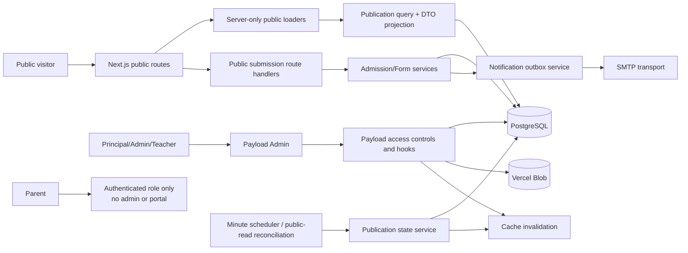
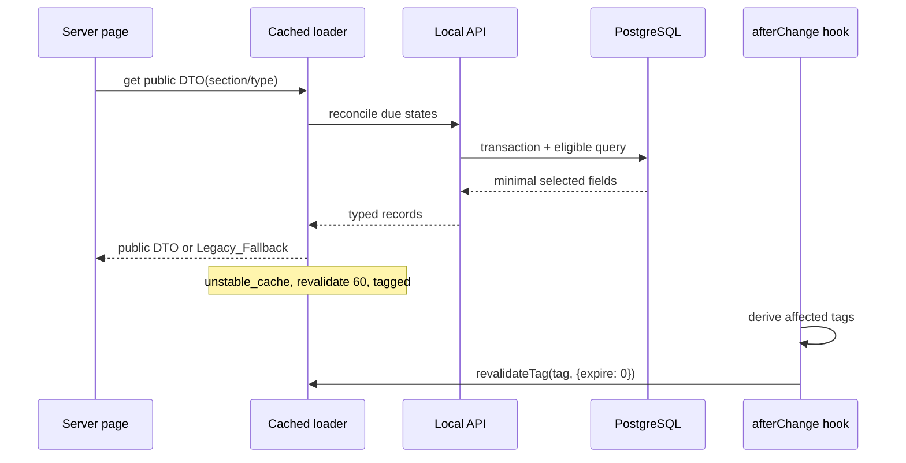
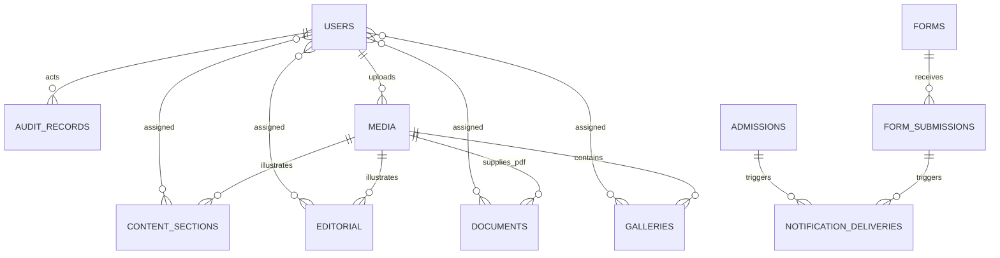
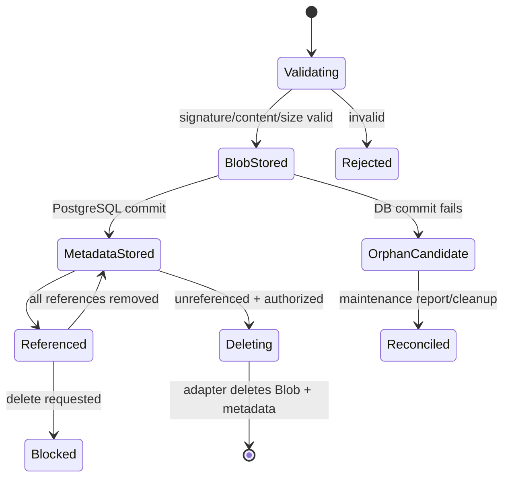

# Design Document: Payload CMS Expansion

## Overview

This design expands the existing single-process Next.js/Payload application into a school website CMS while preserving every current public route, component shell, style token, and protected local image. Payload remains mounted in the existing `(payload)` route group and PostgreSQL remains the system of record. Public App Router pages read projected, publication-filtered DTOs through server-only Payload Local API loaders; client components receive only render-ready public fields.

The implementation target is TypeScript with Payload and all official `@payloadcms/*` packages pinned to exactly `3.88.0`, Next.js `16.2.7`, PostgreSQL, the existing Nodemailer adapter, and the official `@payloadcms/storage-vercel-blob@3.88.0` plugin. The Blob package is not currently installed; its audited package metadata requires `@vercel/blob@2.3.1`, `@payloadcms/plugin-cloud-storage@3.88.0`, and Payload `3.88.0`. `BLOB_READ_WRITE_TOKEN` remains server-only.

Parent remains an authenticated compatibility role only. No parent portal, Payload admin navigation, public account surface, or website-management permission is added.

### Goals

- Extend `users` and `admissions` without destructive recreation.
- Add least-privilege roles, managed content, publication, media, forms, notifications, documents, galleries, audit records, and deterministic migrations.
- Keep public layout and protected imagery unchanged unless an Admin or Principal explicitly publishes replacement content.
- Bound publication, expiration, and editor changes to public visibility within 60 seconds.
- Keep submission persistence independent from optional SMTP delivery.

### Non-goals

Deployment, Blob-store creation, secret rotation, a parent-facing portal, source-control operations, and redesigning public components are outside this feature.

### Research and API Audit

- Installed package manifests confirm Payload and the PostgreSQL adapter are `3.88.0`; upload config supports MIME allowlists, generated image sizes, `disableLocalStorage`, and request-file access for custom validation.
- Payload collection access functions can return booleans or row-level `Where` constraints. Local API access is bypassed by default, so every user-context Local API call must pass `overrideAccess: false` and the authenticated `req`; trusted public projection and migration services are the only documented bypasses ([Payload Local API access control](https://payloadcms.com/docs/local-api/access-control)).
- Payload hooks expose `beforeValidate`, `beforeChange`, `afterChange`, and delete hooks with the same request/context. The PostgreSQL adapter exposes request transaction IDs and transaction configuration, enabling serializable capacity enforcement.
- Payload upload storage is adapter-based and the official Vercel Blob plugin maps configured upload collections to Blob storage ([Payload storage adapters](https://payloadcms.com/docs/upload/storage-adapters)).
- The repository does not enable Next.js 16 Cache Components. Bundled Next.js 16.2.7 guidance therefore prescribes `unstable_cache` for Local API/database functions, numeric `revalidate`, and `revalidateTag` for route-handler invalidation. The one-argument `revalidateTag` form is deprecated; route-handler invalidation uses `revalidateTag(tag, { expire: 0 })` for the required freshness bound.
- `next/image` remote sources require a narrow `images.remotePatterns` allowlist. The design allows HTTPS Vercel public Blob hosts only, while retaining all current site-relative public paths.

Content was rephrased for compliance with licensing restrictions.
## Architecture



### Deployment and Runtime Boundaries

1. **Payload configuration boundary**: `src/payload.config.ts` composes modular collection/global configs, official adapters, generated types, and server-only environment validation.
2. **Domain boundary**: pure TypeScript modules implement authorization predicates, publication state transitions, form validation, media validation, DTO projection, notification recipient selection, sanitization, and migration normalization.
3. **Persistence boundary**: Payload Local API performs ordinary CRUD. The request transaction is reused for multi-record operations; event capacity uses a serializable transaction and retry-on-serialization-conflict policy.
4. **Public read boundary**: server components call loaders directly instead of making loopback HTTP calls. Loaders query with `overrideAccess: true` only in a server-only module, apply the public eligibility predicate, select minimal fields, and map generated Payload types into explicit DTOs.
5. **Public write boundary**: dedicated route handlers for admissions and reusable forms parse bounded JSON, apply rate limits and domain validation, call services, and return narrow outcomes. Raw Payload collection endpoints retain server-side collection access controls.
6. **Storage boundary**: PostgreSQL stores metadata and relationships; Vercel Blob stores all new Payload-managed image/PDF bytes. Existing files in `public/` remain in place as immutable migration fallbacks.
7. **Delivery boundary**: PostgreSQL delivery records form an outbox/audit trail. SMTP attempts happen after the originating record commits, so mail failure cannot roll back a submission.

### Proposed Source Layout

```text
src/
  payload.config.ts
  collections/{Users,Admissions,Media,ContentSections,Editorial,Forms,FormSubmissions,Documents,Galleries,NotificationDeliveries,AuditRecords}.ts
  globals/NotificationSettings.ts
  access/{roles,collectionAccess,fieldAccess}.ts
  cms/
    publication/{model,reconcile,hooks}.ts
    public/{loaders,dto,cache-tags,fallbacks}.ts
    forms/{schema,validate,submit,capacity}.ts
    media/{validate,references}.ts
    notifications/{recipient,render,deliver,retry}.ts
    audit/writeAudit.ts
    migrations/{legacy-manifest,migrateLegacyContent}.ts
  app/(frontend)/api/{admissions,forms/[slug],notifications/retry}/route.ts
  app/(frontend)/api/internal/publication-reconcile/route.ts
migrations/                       # generated/reviewed Payload PostgreSQL migrations
scripts/migrate-legacy-content.ts # explicit, repeatable content migration
```

### Dependency and Configuration Changes

- Pin `payload`, `@payloadcms/db-postgres`, `@payloadcms/email-nodemailer`, `@payloadcms/next`, and `@payloadcms/richtext-lexical` to `3.88.0` instead of ranges.
- Add exact `@payloadcms/storage-vercel-blob@3.88.0`; its audited dependencies resolve to `@vercel/blob@2.3.1` and `@payloadcms/plugin-cloud-storage@3.88.0`.
- Add direct `file-type@21.3.4` for signature detection rather than relying on Payload's transitive dependency.
- Add exact development dependencies `vitest@4.1.10` and `fast-check@4.9.0` for unit/property tests; retain Playwright `1.51.1` for browser verification.
- Add a startup environment parser for `DATABASE_URL`, `PAYLOAD_SECRET`, optional SMTP values, `BLOB_READ_WRITE_TOKEN`, public site origin, and an internal scheduler secret. Production startup fails closed for absent Payload/database/Blob secrets; SMTP may remain disabled.
- Configure the audited named export exactly as `vercelBlobStorage({ collections: { media: { disableLocalStorage: true } }, access: 'public', addRandomSuffix: true, clientUploads: true, enabled: Boolean(env.BLOB_READ_WRITE_TOKEN), token: env.BLOB_READ_WRITE_TOKEN })`. Payload 3.88.0 supports only public Blob access; this collection therefore contains public-intent website assets and no Sensitive_Data. `clientUploads: true` bypasses Vercel function upload limits for 10/20 MiB assets, while its access callback authorizes Principal/Admin/Teacher token requests. Because the plugin falls back to local storage when disabled, production environment validation must fail startup rather than permit that fallback. Configure `next/image` for HTTPS `**.public.blob.vercel-storage.com` paths and preserve existing local paths.

### Publication State Model

A shared field group is embedded in `content-sections`, `editorial`, `forms`, `documents`, and `galleries`:

```ts
type PublicationState = 'draft' | 'scheduled' | 'published' | 'expired' | 'archived'
type PublicationFields = {
  publicationState: PublicationState
  publishAt: string | null
  expiresAt: string | null
  publishedAt: string | null
  publicationActor: UserID | null
  publicationChangedAt: string | null
}
```

`publicationState` is authoritative; Payload versions are enabled for history but native drafts are not used as a second state machine. Allowed transitions are:

```text
draft -> scheduled | published | archived
scheduled -> draft | published | archived
published -> draft | expired | archived
expired -> draft | scheduled | published | archived
archived -> draft
```

Only Principal/Admin can cross into or out of public states. Teacher writes are forced to `draft`. Publishing validates required fields and all referenced assets. `published` requires `publishAt <= now`; `scheduled` requires `publishAt > now`; `expiresAt`, when present, must be later than `publishAt`. The reconciler changes due `scheduled` rows to `published` and elapsed `published` rows to `expired`, records one audit event per transition, and invalidates affected tags.

A protected internal route invokes reconciliation at least once per minute through Vercel Cron or another separately authorized scheduler. As a correctness fallback, every public loader first invokes an idempotent, bounded reconciliation for its own record type, so a visited route is correct even if the scheduler is delayed. Cache entries use `revalidate: 60`; state-change hooks call `revalidateTag(tag, { expire: 0 })`. Reconciliation and cache invalidation errors are sanitized and retried, while the public loader falls back to legacy data.

### Public Rendering and Revalidation Flow



Tags are stable and bounded: `cms:section:<key>`, `cms:editorial:<type>`, `cms:editorial:<slug>`, `cms:forms:<slug>`, `cms:documents`, and `cms:galleries`. Public detail routes set `dynamicParams = true`; CMS slugs are not limited to build-time `generateStaticParams`. Preview loaders are separate, uncached, authenticate the Payload request, pass `overrideAccess: false`, and never expose preview tokens to client code.
## Components and Interfaces

### Role Access Matrix

`users.role` becomes `principal | admin | teacher | parent`; `active: boolean` defaults true. Existing `admin` maps to Admin, `staff` remains readable as an unsupported legacy value during migration and has no privileges until reassigned. Empty-collection bootstrap assigns Principal. Password policy is enforced by a collection hook and auth configuration; production cookies are Secure, HttpOnly, and SameSite=Lax.

| Resource/operation | Principal | Admin | Teacher | Parent | Public |
|---|---:|---:|---:|---:|---:|
| Payload admin entry | Yes | Yes | Yes | No | No |
| Users and role assignment | Full | Own profile only; no Principal mutation | Own profile only | Own profile only through auth API; no portal | No |
| Admissions | Full | Full | No | No | Create only through narrow endpoint |
| Notification settings/retry | Full | Full | No | No | No |
| Forms definitions | Full | Full | No | No | Read published definition DTO only |
| Form submissions | Full | Full | No | No | Create only through narrow endpoint |
| Content/editorial/documents/galleries | Full/publish | Full/publish | Assigned draft create/update | No | Published projection only |
| Media | Full | Full | Create and own/assigned draft assets | No | Published projection metadata/bytes only |
| Delivery/audit records | Read/manage retry | Delivery read/retry; audit read | No | No | No |

Collection `admin` access hides the entire admin for Parent/unsupported/inactive users. Collection access returns row constraints for Teachers (`createdBy = user.id` or `assignedEditors contains user.id`) and field access prevents Teacher mutation of publication/audit fields. User hooks deny Admin operations affecting Principal and deny any change leaving no active Principal. All internal calls carrying a user pass `req` and `overrideAccess: false`.

### Collections and Globals

#### `users` (extend existing)

Fields: `name`, `role`, `active`, optional `assignedSections`, authentication fields, and timestamps. Hooks implement first-user Principal assignment, legacy-role denial, 12-character password checks, last-active-Principal invariant, and role/active-state audit events. Role and active-state fields are Principal-only; Admin cannot target Principal records.

#### `admissions` (extend in place)

Preserve all existing field names and rows. Add `referenceCode` (unique, non-sequential public identifier), `submittedAt`, status transition metadata, normalized validation, masked list-cell UI for Aadhaar, and notification-delivery join. Public creation moves to a narrow route response; raw collection access may still allow create but uses `afterRead`/field access or a custom endpoint so anonymous responses contain only `referenceCode` and outcome. Update/read/delete require Principal/Admin.

#### `media`

One upload collection handles images and PDFs. Metadata fields: `title`, generated upload fields (`filename`, `mimeType`, `filesize`, dimensions/URL), `originalFilename`, `category`, `alt`, `decorative`, `caption`, `uploadedBy`, `uploadedAt`, and `verificationStatus`. `mimeTypes` allows JPEG, PNG, WebP, and PDF; image sizes are generated only for image MIME types. A two-phase client-upload service authorizes the upload token, enforces declared type/size before transfer, then fetches the newly stored public Blob server-side before metadata finalization. The finalizer uses `file-type` to compare extension, declared MIME, and signature, applies 10 MiB/20 MiB limits, rejects executable/polyglot signatures and PDF active-content/encryption markers, and deletes rejected Blob bytes. Records remain `pending` and unavailable to relationships/public DTOs until verification becomes `verified`; verification failure returns a Structured_Validation_Error and leaves no media record. `beforeDelete` queries every relationship-bearing collection and returns structured reference summaries if in use.

The official Vercel Blob plugin owns create/replace/delete byte lifecycle for this collection. Database metadata is created only after upload success; failed metadata writes trigger best-effort orphan deletion and a sanitized operational record. Authorized deletion first verifies no references, then lets the adapter remove the Blob object. A reconciliation utility lists metadata/object discrepancies by pathname without deleting automatically. Original protected files under `public/` are never enrolled in Blob deletion.

#### `content-sections`

Fields: unique stable `key` (`home.hero`, `home.welcome`, `admissions.process`, etc.), `page`, `section`, schema-discriminated content blocks, optional legacy image path, optional replacement media, assigned editors, publication group, and migration fingerprint. Use explicit block schemas—not arbitrary HTML/JSON—for headings, summaries, rich text, links, CTAs, lists, and images. Link validation accepts site-relative, http(s), mailto, and tel only. Public presenters return props matching existing components.

#### `editorial`

A single collection with `kind: news | event | announcement`, unique compound index `(kind, slug)`, common `title`, `summary`, Lexical `body`, image/legacy image source, category, priority, event start/end/location, publication group, assigned editors, and migration fingerprint. Conditional validation requires fields by kind and enforces event ordering. Queries apply requirement-specific ordering.

#### `forms`

Fields: unique `slug`, `type`, `title`, description, enabled flag, ordered `fields` array, optional notification override, optional event capacity/closing time, assigned page placement, publication group, and migration fingerprint. Each field has stable unique `name`, label, type, required flag, options, length limits, and consent text. Definition hooks reject unsupported combinations, duplicate names/options, unsafe defaults, and capacity below accepted count.

#### `form-submissions`

Fields: non-sensitive `referenceCode`, form relationship plus immutable definition version/fingerprint, form type/title snapshot, normalized `values` object, consent snapshots, `submittedAt`, `reviewStatus`, reviewer metadata, hashed rate-limit key, and delivery join. No public reads/updates/deletes. Submission values remain schema-driven but are normalized into a canonical object to support changed form definitions while preserving the exact validated definition snapshot.

#### `documents`

Fields: title, type, category, issue/effective date, academic year, PDF media relationship, description, issue number, audience, display order, publication group, assigned editors, and migration fingerprint. Publication validation requires an existing PDF media record. Public DTOs expose only title/filter metadata, accessible label, and Blob URL.

#### `galleries`

Fields: title, unique slug, description, category, event date, cover media, ordered `images` array (`media`, optional caption/alt override, decorative, displayOrder), publication group, assigned editors, and migration fingerprint. Publication validates every relationship as an image. A deterministic tie-breaker uses media/row ID after `displayOrder`.

#### `notification-deliveries`

Immutable attempt records: `channel`, `sourceType`, polymorphic source ID, recipient, status (`pending | sent | failed | disabled | not_configured`), `attemptNumber`, `attemptedAt`, provider message ID, sanitized error code/message, initiatedBy, and previous-attempt relationship. Only status/result fields may be updated by the delivery service. Every retry creates a new row.

#### `audit-records`

Append-only records: actor ID/role or `system`, action, target collection/ID, UTC timestamp, outcome, and allowlisted metadata diff. Access is Principal read and system create; application services may create with explicit trusted context. Passwords, tokens, file bytes, Aadhaar, addresses, and raw submission values are excluded.

#### `notification-settings` global

Fields: admission enabled/recipient, default form enabled/recipient, and per-form overrides with enabled/recipient. Principal/Admin can update; only server services read. Validation checks email shape. Secrets and SMTP connection data have no fields in this global.

### Domain Service Interfaces

```ts
type PublicResult<T> = { source: 'cms'; data: T } | { source: 'legacy'; data: T }
interface PublicContentRepository {
  section<T>(key: SectionKey): Promise<PublicResult<T>>
  editorial(query: EditorialQuery): Promise<PublicResult<EditorialDTO[]>>
  documents(filter: DocumentFilter): Promise<PublicResult<DocumentDTO[]>>
  gallery(slug?: string): Promise<PublicResult<GalleryDTO[]>>
  form(slug: string): Promise<PublicFormDTO | null>
}

interface PublicationService {
  validateTransition(input: TransitionInput): TransitionResult
  reconcile(scope: PublicationScope, now: Date): Promise<ReconcileSummary>
  invalidate(target: PublicationTarget): void
}

interface FormSubmissionService {
  submit(slug: string, input: unknown, context: PublicRequestContext): Promise<PublicSubmissionResult>
}

interface NotificationService {
  enqueue(source: NotificationSource): Promise<DeliveryRecord>
  deliver(deliveryID: string): Promise<DeliveryRecord>
  retry(deliveryID: string, actor: AuthenticatedUser): Promise<DeliveryRecord>
}
```

### Admission and Form Write Flow

1. Route handler enforces content type/body size, derives a privacy-preserving rate-limit key, parses JSON, and rejects unknown top-level fields.
2. Domain validator trims/normalizes values and returns stable field errors.
3. Service starts a PostgreSQL transaction, creates exactly one source record and initial delivery row, commits, then attempts delivery.
4. Response returns `{ ok: true, reference }` after persistence regardless of delivery result.
5. Notification delivery reads settings at attempt time, selects the configured recipient before the environment fallback, renders an allowlisted template, calls `payload.sendEmail`, and updates only the delivery row.

For capacity-limited event forms, the service begins a Payload/PostgreSQL serializable transaction through the shared request transaction ID, reads accepted count and capacity, creates the registration only below capacity, and retries serialization conflicts a bounded three times. Rejection after exhaustion creates no submission. Review-status changes that alter accepted count use the same service.

### Notification Semantics

Recipient precedence is form/admission setting, then environment fallback. Disabled settings create `disabled`; no recipient creates `not_configured`; transport errors create `failed`; success creates `sent`. Templates include only allowlisted contact/summary fields and a secure admin deep link. Admission templates exclude Aadhaar, full addresses, secrets, and files. SMTP host/port/security/auth/from values come only from environment. Retry requires Principal/Admin, rejects non-failed source attempts, and links a new delivery and audit record without mutating the source submission.
## Data Models

### Relationship Model



### Shared Publication Invariants

- `draft`: public predicate false; `publishAt` optional.
- `scheduled`: `publishAt > now`; public predicate false until reconciled.
- `published`: `publishAt <= now` and (`expiresAt` is null or `expiresAt > now`); public predicate true.
- `expired`: public predicate false; reached automatically or explicitly.
- `archived`: public predicate false and only transitions to `draft`.
- `expiresAt > publishAt` whenever both exist.
- A transition to `published` validates complete content and all media relationships in the same transaction.

### Public DTOs

DTOs are explicit, immutable shapes and never reuse generated Payload document types at the client boundary:

```ts
type PublicMediaDTO = {
  url: string
  width?: number
  height?: number
  alt: string
  decorative: boolean
  caption?: string
}
type EditorialDTO = {
  kind: 'news' | 'event' | 'announcement'
  slug: string
  title: string
  summary?: string
  body?: SerializedLexicalPublicTree
  image?: PublicMediaDTO | { legacyPath: string; alt: string }
  publicationTime: string
  event?: { start: string; end: string; location: string }
  priority?: number
}
type PublicFormDTO = {
  slug: string
  type: 'contact' | 'feedback' | 'event_registration'
  title: string
  fields: PublicFieldDTO[]
  closesAt?: string
  acceptingSubmissions: boolean
}
```

The Lexical presenter allowlists supported nodes/marks and strips relationships or attributes not needed by existing components. Submission, user, settings, delivery, and audit generated types never cross this boundary.

### Legacy Migration and Fallback Model

`legacy-manifest.ts` is a versioned, source-controlled manifest produced from existing JSX arrays and `src/data/events.json`. Each item has `sourceKey`, source path, stable destination key/slug, normalized value, protected image path, and SHA-256 content fingerprint. Upserts target unique stable keys, set `migrationSource` and `migrationFingerprint`, and never delete source files or constants.

Migration rules:

1. Schema migrations add nullable/defaulted columns and new tables first; existing `users` and `admissions` tables are altered in place.
2. Existing `admin` users become `admin`; `staff` remains unsupported and inactive for privileged access pending Principal reassignment. The migration does not invent Principal authority except the existing empty-collection bootstrap rule.
3. Legacy content migration is explicit and idempotent. Same key/fingerprint is skipped; same key with migration-owned unchanged fields may be updated; editor-modified records are reported as conflicts and left untouched.
4. Existing image paths remain `legacyPath`; migration does not upload Protected_Imagery to Blob. A later authorized replacement adds a media relationship while retaining the legacy path for rollback.
5. Placeholder `#` document links cannot become publishable PDF documents. They remain legacy fallback entries and are reported as skipped until an authorized editor uploads a PDF.
6. Each independent item runs in its own transaction. The summary reports created, updated, skipped, conflict, and failed counts with sanitized source keys.
7. Public presenters use CMS only when a complete eligible record exists. Absent, invalid, or failed CMS reads return the typed legacy constant and log a sanitized error code; they never merge partial CMS data into a fallback component.

### Media and Blob Lifecycle



Blob pathnames use a non-secret stable prefix plus collision-resistant suffix; URLs and metadata are safe for public rendering, but the token never leaves server configuration. Replacement is modeled as a new upload followed by relationship update, not in-place mutation, so published pages do not point at partially overwritten bytes. Blob cleanup occurs only after relationship checks and transaction success.

### Rate Limiting and Privacy

Public form requests use a server-side HMAC of normalized client IP plus rotating window identifier; raw addresses are not stored. A PostgreSQL-backed fixed-window counter enforces more than 10 requests per 10 minutes consistently across Vercel instances. Admissions can share the infrastructure with a separately configured conservative limit without changing the specified form threshold. Expired counters are removed by maintenance code.
## Correctness Properties

*A property is a characteristic or behavior that should hold true across all valid executions of a system—essentially, a formal statement about what the system should do. Properties serve as the bridge between human-readable specifications and machine-verifiable correctness guarantees.*

### Property 1: Public fallback is total and exact

For any managed public read that returns no eligible record or throws any internal error, the presenter returns the complete corresponding Legacy_Fallback and emits no partial CMS value; any recorded error contains neither secrets nor Sensitive_Data.

**Validates: Requirements 1.3, 1.4, 5.4, 10.10, 11.10, 12.12**

### Property 2: Admission validator enforces the complete input contract

For any admission input, acceptance occurs only when every required trimmed value is non-empty, every enum belongs to its allowlist, the birth date is not in the future, email/phone/Aadhaar values satisfy their formats, and every string is within its field limit.

**Validates: Requirements 2.5, 2.6, 2.7, 2.8, 2.9, 2.11, 2.12**

### Property 3: Admission public projection is minimal

For any successfully persisted admission, the anonymous result contains a non-sensitive reference and outcome and contains no admission field, status metadata, credential, or Sensitive_Data; for any persistence failure, no reference is returned.

**Validates: Requirements 2.15, 2.16, 2.17, 11.2**

### Property 4: Notification recipient selection is deterministic

For any combination of notification enablement, valid or invalid CMS recipient, and valid or invalid environment fallback, selection returns `disabled` without transport when disabled, otherwise the valid CMS recipient before the valid fallback, and otherwise `not_configured`.

**Validates: Requirements 3.1, 3.5, 3.6, 7.16, 7.17, 7.18**

### Property 5: Notification and audit projections exclude forbidden data

For any admission, form submission, delivery error, or audit metadata containing passwords, tokens, credentials, Aadhaar, full addresses, uploaded bytes, or other forbidden values, rendered email, delivery error, audit record, and public error projections contain none of those values.

**Validates: Requirements 3.9, 7.21, 11.6, 11.8, 11.10, 12.15**

### Property 6: Authorization matches the role matrix and fails closed

For any role state, resource, operation, target owner/assignment, and target role, the authorization result equals the documented access matrix; absent, inactive, unsupported, Parent, and indeterminate principals receive no administrative permission, and Teacher mutation is limited to assigned or owned drafts/media.

**Validates: Requirements 4.2, 4.3, 4.4, 4.5, 4.6, 4.7, 4.8, 4.10, 6.9, 11.4, 11.9**

### Property 7: An active Principal always remains

For any user set containing at least one active Principal and any user update or deletion, an accepted operation leaves at least one active Principal; any operation that would leave zero active Principals is rejected without changing the set.

**Validates: Requirements 4.13**

### Property 8: Publication transitions preserve state invariants

For any managed record, actor role, requested publication transition, and publication/expiration times, an accepted transition belongs to the transition graph, is authorized for the actor, satisfies time ordering and record completeness, and forces every Teacher-authored mutation to `draft`.

**Validates: Requirements 5.7, 8.6, 8.9, 9.4, 9.10, 10.3, 10.8**

### Property 9: Reconciliation matches effective publication time

For any scheduled or published record and any current time, reconciliation makes the record publicly eligible if and only if the resulting state is `published`, `publishAt` is not later than current time, and `expiresAt` is absent or later than current time; repeated reconciliation at the same time is idempotent.

**Validates: Requirements 5.3, 7.5, 8.7, 8.8, 9.6, 10.5, 12.8**

### Property 10: Media format descriptors agree

For any uploaded byte sequence, filename extension, and declared MIME type, the media validator accepts the format only when all three identify the same JPEG, PNG, WebP, or PDF type and the type-specific byte limit is satisfied.

**Validates: Requirements 6.2, 6.3, 6.4, 12.9**

### Property 11: Unsafe media and inaccessible images are rejected or normalized

For any media upload, executable, active-content, encrypted, polyglot, or unsupported content is rejected; any accepted non-decorative image has 1–250 alternative-text characters, while any accepted decorative image stores and renders an empty alternative value.

**Validates: Requirements 6.5, 6.6, 6.7, 6.8, 12.9**

### Property 12: Referenced assets cannot be deleted

For any media record and generated set of content, editorial, document, gallery, or form references, deletion succeeds only when the authorized actor may delete the asset and the reference set is empty; otherwise the result identifies every referencing record and preserves metadata and bytes.

**Validates: Requirements 6.9, 6.11, 12.9**

### Property 13: Form definitions and submissions agree

For any enabled, publicly eligible form definition and submitted value map, submission validation succeeds if and only if field names are unique and supported and every submitted value satisfies required, option, format, consent, closing-time, and effective-length constraints; every error maps to its definition field identifier.

**Validates: Requirements 7.2, 7.3, 7.4, 7.6, 7.12, 7.13, 7.15, 12.10**

### Property 14: Event capacity is never exceeded

For any positive capacity and any sequential or concurrent set of registration/review operations, the committed accepted-registration count never exceeds capacity, and every operation rejected for capacity creates no accepted registration.

**Validates: Requirements 7.10, 7.11, 12.10**

### Property 15: Public form rate limiting matches the fixed-window model

For any client key and timed request sequence, the first ten requests in a ten-minute window are not rejected by this limit, every later request before the window ends is rejected, and the first request in the next window is eligible again.

**Validates: Requirements 7.22, 12.10**

### Property 16: Public ordering matches the record-type comparator

For any eligible record set, news are ordered by publication time descending, upcoming events by start ascending, past events by start descending, announcements by priority then publication time descending, circulars/newsletters by effective date descending, and gallery images by display order then stable identifier.

**Validates: Requirements 8.11, 8.12, 8.13, 8.14, 9.8, 10.6, 12.11**

### Property 17: Public DTOs are allowlisted and filter-correct

For any generated persisted records and document filters, public projections contain exactly the fields allowlisted for rendering, contain only eligible records matching all requested filters, and contain no administrative, submission, authentication, secret, or storage-credential field.

**Validates: Requirements 6.12, 9.6, 9.7, 11.2, 11.9, 12.11, 12.15**

### Property 18: Legacy migration is idempotent and failure-isolated

For any legacy manifest, running migration twice against unchanged input produces an equivalent managed state with no duplicate stable keys; invalid or conflicting items do not alter independent valid items, preserve their fallback source, and produce accurate sanitized outcome counts.

**Validates: Requirements 1.6, 5.5, 8.16, 9.12, 10.9, 12.1, 12.2, 12.3**

## Error Handling

| Failure | Behavior | Public result | Operational record |
|---|---|---|---|
| CMS read/query failure | Catch only at public repository boundary | Exact Legacy_Fallback | Sanitized code, collection/key, correlation ID |
| Invalid public input | Reject before repository mutation | 400/422 structured field errors | Aggregate metric only; no raw values |
| Unauthorized operation | Deny before protected read/write | 401/403 with generic body | Actor/operation/target when authenticated |
| PostgreSQL conflict/transient error | Roll back; retry safe serializable operations up to 3 times | Generic retry/failure; no reference unless committed | Sanitized DB category, no SQL/connection data |
| SMTP absent/disabled/failure | Preserve source; create terminal delivery state | Submission success if source committed | Delivery record with sanitized reason |
| Blob upload failure | Abort metadata creation | Admin structured upload error | Sanitized provider category/path prefix |
| Metadata commit after Blob upload fails | Mark orphan candidate for reconciliation | Admin failure | Object pathname hash and correlation ID |
| Referenced media deletion | Reject delete | Admin reference summary | Optional denied audit event |
| Publication validation failure | Keep prior state/version | Field/relationship errors in admin | No transition audit; validation outcome only |
| Reconciliation/cache invalidation failure | Retry; loaders retain 60-second query bound/fallback | Last valid cache or Legacy_Fallback | Sanitized transition/tag code |
| Migration item failure | Roll back item and continue | Legacy source remains active | Sanitized source key and category |

Error utilities expose stable codes such as `VALIDATION_ERROR`, `FORM_UNAVAILABLE`, `CAPACITY_REACHED`, `RATE_LIMITED`, `NOT_AUTHORIZED`, `MEDIA_REFERENCED`, and `SERVICE_UNAVAILABLE`. Raw exceptions remain server-side and pass through a recursive key/value sanitizer before structured logging.

## Testing Strategy

### Test Layers

1. **Vitest unit tests**: validators, role predicates, publication transitions, recipient selection, email/audit sanitization, DTO presenters, ordering comparators, cache-tag derivation, and migration normalization.
2. **fast-check property tests**: implement each of the 18 properties above as one property test with at least 100 runs. Each test includes the comment `Feature: payload-cms-expansion, Property N: <property title>` and uses shrinkable generators for roles, records, times, strings, file descriptors, reference graphs, forms, request sequences, and manifests.
3. **Payload/PostgreSQL integration tests**: run migrated schemas against an isolated database; cover existing-row preservation, Local API `overrideAccess: false`, REST/GraphQL parity, serializable capacity races, audit/delivery creation, retry nonduplication, and publication reconciliation. SMTP uses a mock/test transport. Blob tests use a fake adapter for routine runs and a separately enabled synthetic-object contract test; no Protected_Imagery is uploaded.
4. **Playwright tests**: retain admissions/admin regression tests; add role-aware admin navigation, public form flows, draft denial, news detail dynamic slug, document filters/downloads, gallery order, fallback on injected CMS failure, and public response secret scans.
5. **Visual regression**: capture representative desktop/mobile views for `/`, `/admissions`, `/news-events`, `/news-events/[slug]`, `/gallery`, and `/mandatory-public-disclosure`; compare typography, spacing, colors, links, image references, grid/aspect ratio, and hover states. Hash every Protected_Imagery file and verify HTTP availability before/after migration.
6. **Static/smoke checks**: exact package versions, generated Payload types/import map, migration status, production cookie flags, environment-schema failure modes, Blob remote image allowlist, no secret-bearing CMS fields, and no parent portal/admin exposure.

### Time and Cache Verification

Use a fake clock for pure eligibility/reconciliation tests. Integration tests create records one second around publish/expire boundaries, invoke the internal reconciler, and assert immediate tagged-cache expiry. A browser contract test publishes through the test service and polls the public route with a 60-second upper bound. The test records transition time, invalidation time, and first visible time to diagnose scheduler versus cache failures.

### Security Verification

- Table-driven tests cover Principal, Admin, Teacher, Parent, unauthenticated, inactive, missing-role, `staff`, and unknown-role principals across CRUD, publish, retry, settings, and preview operations.
- The same protected operation is exercised through REST, GraphQL, and Local API with `overrideAccess: false`.
- Serialized public responses and logs are seeded with sentinel credentials, tokens, Aadhaar, addresses, and file bytes and scanned for leakage.
- Upload fixtures cover true/mismatched JPEG/PNG/WebP/PDF signatures, boundary sizes, polyglots, executable headers, active PDF markers, encrypted PDFs, alt-text boundaries, and reference deletion.
- Rate and capacity tests use isolated PostgreSQL state; parallel tests assert committed invariants rather than response ordering.

### Migration Verification and Rollback

Before applying content migration, export schema-level backups through the separately authorized operations process. Automated migration tests run `up` against snapshots of current `users`/`admissions`, verify data preservation, run legacy content migration twice, and compare normalized database snapshots. Application rollback is additive: old source constants and local image files remain available, presenters can disable CMS records to restore fallback, and new nullable tables/columns do not require destructive down-migration. Blob objects created by a failed test migration are reported for explicit cleanup; no automated rollback deletes Protected_Imagery.

### Readiness Gate

The feature is ready for a separately authorized deployment only when type generation, lint, unit/property tests, database integration tests, Playwright checks, visual comparisons, migration idempotence, package/version smoke checks, protected-image hashes, and secret scans all pass. Deployment, store provisioning, credentials, commits, and pushes remain outside this design.
