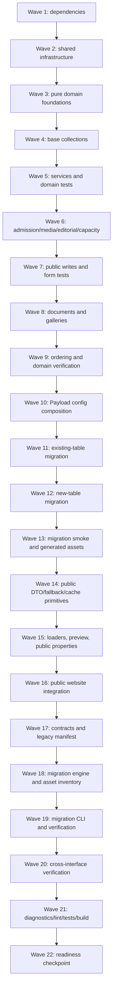

# Implementation Plan: Payload CMS Expansion

## Overview

This TypeScript plan expands the existing Payload 3.88.0 and Next.js 16.2.7 application through additive schema changes, modular domain services, narrow public interfaces, deterministic migration, and layered verification. Tasks are ordered by dependency and grouped into execution waves so `spec-task-execution` subagents can work in parallel without editing the same files.

## Execution Rules

- Run tasks from `C:\Users\Aneesh\Documents\Code\github\frontend`; consult the installed Next.js 16.2.7 documentation under `node_modules/next/dist/docs/` before changing Next.js APIs.
- Preserve completed `payload-admin-panel-rendering-fix` work: do not recreate `src/app/layout.tsx`, remove `@payloadcms/next/css`, reorder it after `custom.scss`, hand-edit an empty import map, broaden raw admission access, or weaken `tests/payload-admin-rendering.spec.ts` and `tests/admissions-post.spec.ts`.
- Keep `src/app/(payload)/layout.tsx`, `src/app/(payload)/admin/[[...segments]]/*`, and `src/app/(payload)/admin/serverFunction.ts` structurally unchanged unless generated-artifact diagnostics require a version-compatible import update.
- Use additive PostgreSQL migrations. Extend existing `users` and `admissions` tables in place; create new tables before backfills and constraints; preserve legacy `staff` values; do not drop source columns, records, constants, routes, or files.
- Never place database, SMTP, Payload, scheduler, or Blob credentials in Payload records, client bundles, fixtures, logs, or specs. Use environment names and synthetic values only.
- Tests marked `*` are optional implementation-plan subtasks, but they define the approved verification coverage. Every property test uses `fast-check@4.9.0`, at least 100 runs, and one test per design property.
- Do not deploy, provision services, rotate secrets, commit, push, or remove Protected_Imagery. Development servers and watchers must be started manually; automated commands must be single-run commands.

## Tasks

- [x] 1. Establish pinned dependencies and shared CMS infrastructure
  - **Depends on:** None
  - **Owned files:** `package.json`, `package-lock.json`, `vitest.config.ts`, `src/cms/config/env.ts`, `src/cms/errors/*`, `src/cms/testing/*`
  - _Requirements: 1.1, 1.8, 1.9, 3.3, 3.4, 6.13, 6.14, 11.1, 11.8, 11.10, 12.16, 12.17_

  - [x] 1.1 Install and pin the approved dependency set
    - Run `npm install --save-exact payload@3.88.0 @payloadcms/db-postgres@3.88.0 @payloadcms/email-nodemailer@3.88.0 @payloadcms/next@3.88.0 @payloadcms/richtext-lexical@3.88.0 @payloadcms/storage-vercel-blob@3.88.0 @payloadcms/plugin-cloud-storage@3.88.0 @vercel/blob@2.3.1 file-type@21.3.4` and `npm install --save-dev --save-exact vitest@4.1.10 fast-check@4.9.0`.
    - Keep `next@16.2.7`, `eslint-config-next@16.2.7`, and `@playwright/test@1.51.1` exact; preserve the rendering-fix scripts while adding single-run unit/property/integration scripts.
    - Commit neither manifests nor lockfile; this task only changes `package.json` and `package-lock.json` during implementation.
    - _Requirements: 1.1, 1.8, 1.9_

  - [x]* 1.2 Add the Vitest single-run configuration and test partitions
    - Create `vitest.config.ts` with Node environment projects or include patterns for `tests/unit`, `tests/property`, and `tests/integration`; configure no watch mode and isolate database-backed tests behind explicit environment flags.
    - Add scripts for `test:unit`, `test:property`, and `test:integration` using `vitest --run`; retain existing Playwright scripts unchanged.
    - _Requirements: 12.4, 12.5, 12.6, 12.7, 12.8, 12.9, 12.10, 12.11, 12.12_

  - [x] 1.3 Implement fail-closed server environment parsing
    - Create `src/cms/config/env.ts` for `DATABASE_URL`, `PAYLOAD_SECRET`, Blob token, public origin, scheduler secret, optional SMTP settings, and notification fallbacks; reject missing production database/Payload/Blob values while allowing SMTP to be disabled.
    - Export only server-side typed values and booleans; never expose raw secrets through public DTOs or Payload fields.
    - _Requirements: 3.3, 3.4, 6.13, 6.14, 11.1_

  - [x] 1.4 Implement structured errors and recursive sanitization
    - Create `src/cms/errors/codes.ts`, `structured-error.ts`, `sanitize.ts`, and `log.ts` with stable codes, field-addressable validation errors, correlation IDs, allowlisted operational context, and recursive credential/Sensitive_Data removal.
    - Ensure public errors omit stacks, SQL, SMTP details, storage tokens, raw values, and secret-bearing causes.
    - _Requirements: 2.5, 5.9, 6.4, 6.5, 7.6, 11.8, 11.10_

  - [x]* 1.5 Create synthetic shared verification fixtures
    - Add `tests/fixtures/` builders for users, admissions, forms, editorial records, synthetic image/PDF bytes, sentinel secrets, and fake clocks; explicitly exclude Protected_Imagery and production recipients.
    - Provide mock SMTP and fake Blob adapter helpers for downstream tests without outbound delivery or production storage mutation.
    - _Requirements: 12.7, 12.16, 12.17_

  - [x]* 1.6 Write unit tests for environment, structured errors, and sanitization
    - Cover production fail-closed behavior, optional SMTP disablement, stable field errors, recursive redaction, and generic public failure projection in `tests/unit/config-env.test.ts` and `tests/unit/sanitize.test.ts`.
    - _Requirements: 3.3, 3.4, 11.1, 11.8, 11.10, 12.15_

- [x] 2. Build the role, access, audit, settings, and notification foundation
  - **Depends on:** Task 1
  - **Owned files:** `src/access/*`, `src/collections/Users.ts`, `src/collections/AuditRecords.ts`, `src/collections/NotificationDeliveries.ts`, `src/globals/NotificationSettings.ts`, `src/cms/audit/*`, `src/cms/notifications/*`
  - _Requirements: 3.1-3.10, 4.1-4.17, 7.16-7.21, 11.4-11.7_

  - [x] 2.1 Implement pure role and row-access predicates
    - Create `src/access/roles.ts`, `collectionAccess.ts`, and `fieldAccess.ts` for Principal, Admin, Teacher, Parent, inactive, missing, `staff`, unknown, owner, assignment, and publication decisions.
    - Require authenticated Local API calls to carry `req` and `overrideAccess: false`; fail closed on indeterminate decisions.
    - _Requirements: 4.1-4.11, 6.9, 11.4, 11.7, 11.9_

  - [x] 2.2 Extend the existing users collection without recreation
    - Create `src/collections/Users.ts` using existing field names plus supported/legacy role handling, `active`, assignments, first-user Principal bootstrap, minimum 12-character password validation, secure production cookie settings, Admin-to-Principal denial, and last-active-Principal checks.
    - Emit role/active-state audits without passwords and return generic authentication failures.
    - _Requirements: 1.2, 4.1-4.5, 4.8-4.17_

  - [x] 2.3 Add append-only audit records and the trusted audit writer
    - Create `src/collections/AuditRecords.ts` and `src/cms/audit/writeAudit.ts`; permit trusted-system create and Principal read, block ordinary mutation, and allowlist actor/action/target/time/outcome metadata.
    - Exclude passwords, tokens, Aadhaar, addresses, raw submissions, credentials, and file bytes.
    - _Requirements: 3.10, 4.14, 11.5, 11.6_

  - [x] 2.4 Add notification settings and immutable delivery attempts
    - Create `src/globals/NotificationSettings.ts` and `src/collections/NotificationDeliveries.ts` with Principal/Admin update access, validated admission/default/per-form recipients, enablement, terminal outcomes, attempt chains, and service-only result updates.
    - Keep SMTP connection values absent from all Payload schemas and admin fields.
    - _Requirements: 3.2, 3.3, 3.8, 3.10, 7.16-7.20, 11.5_

  - [x] 2.5 Implement notification recipient, rendering, delivery, and retry services
    - Create `src/cms/notifications/{recipient,render,deliver,retry}.ts`; select configured recipient before environment fallback, handle disabled/not-configured/failed/sent outcomes, deliver after source commit, and create linked retry/audit rows without duplicating sources.
    - Use allowlisted email fields and sanitized provider results only.
    - _Requirements: 3.1, 3.4-3.11, 7.16-7.21, 12.6, 12.7_

  - [x]* 2.6 Write Property 4: Notification recipient selection is deterministic
    - In `tests/property/notification-recipient.property.test.ts`, generate enablement and valid/invalid CMS/environment recipients and verify precedence/outcomes with at least 100 runs.
    - Include comment `Feature: payload-cms-expansion, Property 4: Notification recipient selection is deterministic`.
    - **Validates: Requirements 3.1, 3.5, 3.6, 7.16, 7.17, 7.18**

  - [x]* 2.7 Write Property 6: Authorization matches the role matrix and fails closed
    - Create `tests/property/authorization-matrix.property.test.ts` with generated role/resource/operation/ownership/assignment combinations, the exact Property 6 feature comment, and at least 100 runs.
    - **Validates: Requirements 4.2, 4.3, 4.4, 4.5, 4.6, 4.7, 4.8, 4.10, 6.9, 11.4, 11.9**

  - [x]* 2.8 Write Property 7: An active Principal always remains
    - Create `tests/property/active-principal.property.test.ts` with generated user sets and updates/deletions, the exact Property 7 feature comment, and at least 100 runs.
    - **Validates: Requirements 4.13**

- [x] 3. Harden structured admissions and admission delivery
  - **Depends on:** Tasks 1 and 2
  - **Owned files:** `src/collections/Admissions.ts`, `src/cms/admissions/*`, `src/app/(frontend)/api/admissions/route.ts`, admission-focused tests
  - _Requirements: 2.1-2.18, 3.1-3.11, 11.3, 11.5, 11.7, 11.8, 12.4, 12.6_

  - [x] 3.1 Implement the pure admission schema, normalization, and validator
    - Create `src/cms/admissions/{schema,normalize,validate}.ts` covering required trimmed fields, approved enums/checklist values, dates, email, phone digit count, 12-digit Aadhaar, 200/2,000-character limits, unknown fields, and stable field errors.
    - Preserve current form-to-collection names established by the rendering fix.
    - _Requirements: 2.2, 2.5-2.9, 2.11, 2.12, 11.3_

  - [x] 3.2 Modularize and extend admissions in place
    - Create `src/collections/Admissions.ts` preserving all current fields/rows while adding unique non-sequential `referenceCode`, UTC `submittedAt`, status defaults/metadata, masked Aadhaar list rendering, Principal/Admin private access, and hooks for validation, status audit, and delivery enqueue.
    - Keep raw anonymous read/update/delete denied and prevent full-document anonymous create responses.
    - _Requirements: 1.2, 2.1-2.4, 2.10, 2.13, 2.14, 2.17, 2.18, 11.5, 11.7_

  - [x] 3.3 Implement the narrow admission submission service
    - Create `src/cms/admissions/submit.ts` to validate, transactionally create exactly one admission and initial delivery row, commit before SMTP, and return only `{ ok, reference }` on persistence success.
    - Preserve source success for every notification terminal outcome and return no reference on persistence failure.
    - _Requirements: 2.1, 2.3, 2.15-2.17, 3.6, 3.7, 3.11, 12.6_

  - [x] 3.4 Add the dedicated public admissions route and admin retry route wiring
    - Implement `src/app/(frontend)/api/admissions/route.ts` with bounded JSON/content-type parsing and generic structured failures; add `src/app/(frontend)/api/notifications/retry/route.ts` as the authenticated Principal/Admin retry entry without exposing private fields.
    - Update `src/app/(frontend)/apply/page.tsx` only to consume the narrow success/failure contract; preserve current layout and the rendering-fix `contactNumber` mapping.
    - _Requirements: 2.15-2.18, 3.10, 3.11, 11.3, 11.8_

  - [x]* 3.5 Write Property 2: Admission validator enforces the complete input contract
    - Create `tests/property/admission-validator.property.test.ts` with at least 100 generated valid/invalid payloads and the exact Property 2 feature comment.
    - **Validates: Requirements 2.5, 2.6, 2.7, 2.8, 2.9, 2.11, 2.12**

  - [x]* 3.6 Write Property 3: Admission public projection is minimal
    - Create `tests/property/admission-public-projection.property.test.ts` with generated persisted/failure results and scans for all admission, credential, administrative, and Sensitive_Data fields.
    - **Validates: Requirements 2.15, 2.16, 2.17, 11.2**

  - [x]* 3.7 Extend admissions integration and rendering-fix regression coverage
    - Extend `tests/admissions-post.spec.ts` rather than replacing it; add private-operation denial, validation boundaries, masked admin list data, status audit, mock-email independence, and retry nonduplication using synthetic records.
    - Keep `tests/payload-admin-rendering.spec.ts` admin-control checks intact.
    - _Requirements: 2.4, 2.10, 2.13-2.18, 3.7-3.11, 12.4, 12.6, 12.7_

- [x] 4. Implement verified Vercel Blob media management
  - **Depends on:** Tasks 1 and 2
  - **Owned files:** `src/collections/Media.ts`, `src/cms/media/*`, `src/cms/storage/*`, `next.config.ts`, media-focused tests
  - _Requirements: 6.1-6.14, 10.2, 10.8, 11.1, 12.9, 12.17_

  - [x] 4.1 Implement pure media descriptor, signature, content, size, and accessibility validation
    - Create `src/cms/media/validate.ts` using `file-type@21.3.4`; compare extension, declared MIME, and detected signature for JPEG/PNG/WebP/PDF, enforce 10/20 MiB limits, reject executable/polyglot/script-capable/encrypted PDFs, and normalize decorative/alt values.
    - Return Structured_Validation_Error values without echoing bytes or unsafe metadata.
    - _Requirements: 6.2-6.8, 12.9_

  - [x] 4.2 Add the verified media upload collection and ownership rules
    - Create `src/collections/Media.ts` with required metadata, `pending|verified|failed` verification, uploader/time fields, image-only sizes, public render projection, and Teacher owner/Admin/Principal mutation rules.
    - Keep unverified records unavailable to relationships and public DTOs.
    - _Requirements: 6.1, 6.6-6.10, 6.12_

  - [x] 4.3 Configure Vercel Blob and the two-phase upload/finalization lifecycle
    - Create `src/cms/storage/vercelBlob.ts` and `src/cms/media/finalize.ts`; configure `vercelBlobStorage` exactly as approved with public access, random suffixes, client uploads, token gating, and `disableLocalStorage: true` for media.
    - Authorize client-upload tokens by role, verify newly stored bytes before metadata finalization, delete rejected objects, and record DB-failure orphan candidates without automatic destructive cleanup.
    - Add only HTTPS `**.public.blob.vercel-storage.com` to `next.config.ts` remote patterns while retaining local image behavior.
    - _Requirements: 6.2-6.5, 6.10, 6.13, 6.14, 11.1_

  - [x] 4.4 Implement relationship-safe deletion and Blob discrepancy reporting
    - Create `src/cms/media/references.ts` to enumerate content/editorial/document/gallery/form references, block referenced deletion with authorized summaries, and preserve metadata/bytes on denial.
    - Create a report-only metadata/object reconciliation utility; exclude `public/` and Protected_Imagery from Blob lifecycle operations.
    - _Requirements: 1.7, 6.9, 6.11, 12.14_

  - [x]* 4.5 Write Property 10: Media format descriptors agree
    - Create `tests/property/media-descriptors.property.test.ts` using synthetic descriptor/byte generators, boundary sizes, and at least 100 runs.
    - **Validates: Requirements 6.2, 6.3, 6.4, 12.9**

  - [-]* 4.6 Write Property 11: Unsafe media and inaccessible images are rejected or normalized
    - Create `tests/property/media-safety.property.test.ts` covering unsafe headers/PDF markers, unsupported content, decorative images, and alt-text boundaries with at least 100 runs.
    - **Validates: Requirements 6.5, 6.6, 6.7, 6.8, 12.9**

  - [-]* 4.7 Write Property 12: Referenced assets cannot be deleted
    - Create `tests/property/media-references.property.test.ts` with generated relationship graphs and role/owner combinations; verify complete reference summaries and no metadata/byte deletion on denial.
    - **Validates: Requirements 6.9, 6.11, 12.9**

- [ ] 5. Implement publication state and managed content sections
  - **Depends on:** Tasks 1, 2, and 4
  - **Owned files:** `src/cms/publication/*`, `src/collections/ContentSections.ts`, `src/cms/content/*`, publication/content tests
  - _Requirements: 5.1-5.10, 8.6-8.10, 9.4-9.6, 10.3-10.7, 11.5, 12.8_

  - [~] 5.1 Implement publication fields, eligibility, transitions, and validation
    - Create `src/cms/publication/model.ts` with the approved five states and transition graph, time ordering, role authorization, Teacher-to-draft forcing, completeness callbacks, and publication actor/time metadata.
    - Provide shared field definitions and hooks without using native Payload drafts as a second state machine.
    - _Requirements: 5.7, 8.6, 8.9, 8.10, 9.4, 9.5, 10.3, 10.4, 11.5_

  - [~] 5.2 Implement idempotent bounded publication reconciliation
    - Create `src/cms/publication/reconcile.ts` and `hooks.ts`; promote due scheduled records, expire elapsed records, emit one audit per transition, retry safe transaction failures, and derive cache invalidations.
    - Add `src/app/(frontend)/api/internal/publication-reconcile/route.ts` protected by the scheduler secret and scoped reconciliation limits.
    - _Requirements: 5.10, 8.7, 8.8, 10.7, 11.5, 12.8_

  - [~] 5.3 Add schema-discriminated content sections and presenters
    - Create `src/collections/ContentSections.ts` and `src/cms/content/{blocks,validate,present}.ts` with stable keys, labeled text/rich-text fields, safe links/CTAs/lists/images, legacy paths, replacement media, assignments, limits, publication fields, and migration fingerprints.
    - Return props that fit existing components without arbitrary HTML or source editing.
    - _Requirements: 5.1-5.9, 6.8, 11.2_

  - [ ]* 5.4 Write Property 8: Publication transitions preserve state invariants
    - Create `tests/property/publication-transitions.property.test.ts` with generated records, actors, states, times, completeness, and at least 100 runs.
    - **Validates: Requirements 5.7, 8.6, 8.9, 9.4, 9.10, 10.3, 10.8**

  - [ ]* 5.5 Write Property 9: Reconciliation matches effective publication time
    - Create `tests/property/publication-reconcile.property.test.ts`; use a fake clock and repeated reconciliation to verify eligibility equivalence and idempotence at boundaries.
    - **Validates: Requirements 5.3, 7.5, 8.7, 8.8, 9.6, 10.5, 12.8**

  - [ ]* 5.6 Write content/publication unit tests
    - Cover field limits, safe-link protocols, Teacher draft forcing, invalid transition preservation, rich-text allowlisting, audit metadata, cache-tag derivation, and 60-second freshness configuration.
    - _Requirements: 5.2, 5.7-5.10, 8.6-8.10, 11.5_

  - [ ]* 5.7 Write publication boundary integration tests
    - Use isolated PostgreSQL records one second before/after publish and expiration, invoke reconciliation, verify one transition audit and immediate tag invalidation, and confirm `overrideAccess: false` for user-context Local API calls.
    - _Requirements: 4.11, 5.3, 5.7, 5.10, 8.7-8.10, 12.8_

- [ ] 6. Implement editorial content and ordering
  - **Depends on:** Tasks 2, 4, and 5
  - **Owned files:** `src/collections/Editorial.ts`, `src/cms/editorial/*`, editorial tests
  - _Requirements: 8.1-8.16, 11.2, 11.5, 12.8, 12.11_

  - [~] 6.1 Add the news, event, and announcement collection
    - Create `src/collections/Editorial.ts` with kind-specific required fields, compound kind/slug uniqueness, Lexical body, media/legacy image, assignment, migration fingerprint, and shared publication fields.
    - Enforce event end at/after start and retain Teacher changes as drafts.
    - _Requirements: 8.1-8.6, 8.9, 8.15_

  - [~] 6.2 Implement editorial public projection and comparators
    - Create `src/cms/editorial/{validate,present,order}.ts` with minimal DTOs, Lexical node/mark allowlisting, upcoming/past partitioning, and exact news/event/announcement ordering.
    - _Requirements: 8.2-8.5, 8.11-8.14, 11.2_

  - [~] 6.3 Implement editorial publication audit and cache invalidation hooks
    - Store actor/UTC action metadata for publish/unpublish/schedule/expire/archive and invalidate bounded type/slug tags without exposing draft data.
    - _Requirements: 8.7-8.10, 11.5_

  - [ ]* 6.4 Write Property 16: Public ordering matches the record-type comparator
    - Create `tests/property/public-ordering.property.test.ts` and generate editorial, document, and gallery record sets; verify every approved comparator with at least 100 runs.
    - **Validates: Requirements 8.11, 8.12, 8.13, 8.14, 9.8, 10.6, 12.11**

  - [ ]* 6.5 Write editorial validation and query tests
    - Cover conditional required fields, duplicate kind/slug denial, equal event boundaries, Teacher drafts, publication audits, minimal projections, and list/detail query behavior.
    - _Requirements: 8.2-8.15, 11.2, 11.5, 12.8_

- [ ] 7. Implement reusable forms, submissions, rate limits, and atomic capacity
  - **Depends on:** Tasks 1, 2, and 5
  - **Owned files:** `src/collections/Forms.ts`, `src/collections/FormSubmissions.ts`, `src/collections/RateLimitCounters.ts`, `src/cms/forms/*`, `src/app/(frontend)/api/forms/[slug]/route.ts`, form tests
  - _Requirements: 7.1-7.22, 11.2-11.5, 11.7, 11.8, 12.6, 12.10_

  - [~] 7.1 Implement form-definition schema and validation
    - Create `src/cms/forms/schema.ts` for all approved form/field types, unique stable field names, labels, supported option combinations, consent text, limits, capacity, closing time, notification override, page placement, and publication fields.
    - Reject duplicate/blank options, unsafe defaults, and capacity below accepted count.
    - _Requirements: 7.1-7.3, 7.10, 7.12, 7.15_

  - [~] 7.2 Add forms and immutable schema-snapshot submissions collections
    - Create `src/collections/Forms.ts` and `FormSubmissions.ts` with protected definitions, no public submission reads/updates/deletes, normalized values, immutable definition fingerprint/version and form snapshots, consent snapshots, review metadata, hashed rate key, delivery joins, and admin columns.
    - _Requirements: 7.3-7.9, 7.13, 7.14, 11.5, 11.7_

  - [~] 7.3 Implement server-stored definition submission validation
    - Create `src/cms/forms/validate.ts` to reject unknown/unavailable/disabled/unpublished/not-yet-published/expired forms, unknown fields, format/option/required/consent/length/closing-time violations, and map errors to field identifiers.
    - _Requirements: 7.4-7.6, 7.12, 7.13, 7.15, 11.3_

  - [~] 7.4 Implement PostgreSQL-backed fixed-window rate limiting
    - Create `src/collections/RateLimitCounters.ts` and `src/cms/forms/rate-limit.ts` using an HMAC of normalized client address plus rotating window; atomically permit ten requests per ten minutes and clean expired counters without retaining raw addresses.
    - _Requirements: 7.22, 11.1, 11.3_

  - [~] 7.5 Implement serializable event capacity and review transitions
    - Create `src/cms/forms/capacity.ts` with shared request transaction IDs, serializable accepted-count checks, bounded three-attempt conflict retries, and the same invariant for review-status changes.
    - Ensure capacity rejection or retry exhaustion commits no accepted registration.
    - _Requirements: 7.10, 7.11, 12.10_

  - [~] 7.6 Implement the form submission service and narrow public route
    - Create `src/cms/forms/submit.ts` and `src/app/(frontend)/api/forms/[slug]/route.ts`; parse bounded JSON, validate slug/body, enforce rate/capacity, transactionally create exactly one submission plus delivery, commit before SMTP, and return only a non-sensitive reference/outcome.
    - _Requirements: 7.4-7.8, 7.10-7.22, 11.2, 11.3, 11.8, 12.6_

  - [ ]* 7.7 Write Property 13: Form definitions and submissions agree
    - Create `tests/property/form-validation.property.test.ts` with generated definitions/value maps and at least 100 runs; verify success equivalence and field-addressed errors.
    - **Validates: Requirements 7.2, 7.3, 7.4, 7.6, 7.12, 7.13, 7.15, 12.10**

  - [ ]* 7.8 Write Property 14: Event capacity is never exceeded
    - Create `tests/property/form-capacity.property.test.ts` modeling sequential/concurrent registration and review operations with at least 100 generated schedules.
    - **Validates: Requirements 7.10, 7.11, 12.10**

  - [ ]* 7.9 Write Property 15: Public form rate limiting matches the fixed-window model
    - Create `tests/property/form-rate-limit.property.test.ts` with generated client keys/timed sequences and at least 100 runs across window boundaries.
    - **Validates: Requirements 7.22, 12.10**

  - [ ]* 7.10 Write form integration tests with mock SMTP and PostgreSQL races
    - Cover definition errors, unavailable states, consent snapshots, closing time, exact-one persistence, notification independence/retry, ten-request threshold, and concurrent capacity invariants.
    - _Requirements: 7.3-7.22, 12.6, 12.7, 12.10, 12.16_

- [ ] 8. Implement documents and galleries
  - **Depends on:** Tasks 2, 4, 5, and 6.2
  - **Owned files:** `src/collections/Documents.ts`, `src/collections/Galleries.ts`, `src/cms/documents/*`, `src/cms/galleries/*`, related tests
  - _Requirements: 9.1-9.12, 10.1-10.11, 11.2, 11.5, 12.11_

  - [~] 8.1 Add categorized document records and publication validation
    - Create `src/collections/Documents.ts` with approved types/metadata, PDF relationship, assignments, migration fingerprint, shared publication fields, and validation that blocks missing, non-PDF, unverified, or non-public assets.
    - Retain Teacher writes as drafts and audit Principal/Admin state changes.
    - _Requirements: 9.1-9.5, 9.10, 11.5_

  - [~] 8.2 Implement document filters, ordering, projection, and download safety
    - Create `src/cms/documents/{validate,query,present}.ts`; validate type/category/year filters, return eligible public metadata only, sort circular/newsletter defaults correctly, format holiday-list fields, and expose accessible Blob links without paths/credentials/admin data.
    - _Requirements: 9.6-9.11, 11.2, 11.3_

  - [~] 8.3 Add gallery albums and relationship validation
    - Create `src/collections/Galleries.ts` with unique slug, cover, ordered image rows, accessibility overrides/decorative values, assignments, migration fingerprint, and shared publication fields.
    - Prevent publication for missing, non-image, or unverified assets and retain Teacher writes as drafts.
    - _Requirements: 10.1-10.4, 10.8_

  - [~] 8.4 Implement gallery ordering and public projection
    - Create `src/cms/galleries/{validate,order,present}.ts`; return eligible albums/images only, order by display order then stable identifier, and normalize image accessibility metadata.
    - _Requirements: 10.2, 10.5-10.8, 11.2_

  - [ ]* 8.5 Write document unit and integration tests
    - Cover filters, default order, holiday fields, publication constraints, accessible download projection, Teacher draft retention, and public field minimization.
    - _Requirements: 9.1-9.11, 12.11_

  - [ ]* 8.6 Write gallery unit and integration tests
    - Cover unique slugs, asset validation, stable tie ordering, eligible-only projection, publication audits, and accessibility rendering.
    - _Requirements: 10.1-10.8, 12.11_

- [ ] 9. Compose modular Payload configuration and additive database migrations
  - **Depends on:** Tasks 2 through 8
  - **Owned files:** `src/collections/index.ts`, `src/globals/index.ts`, `src/payload.config.ts`, `migrations/*`, `src/payload-types.ts`, `src/app/(payload)/admin/importMap.js`
  - _Requirements: 1.1, 1.2, 3.3, 3.4, 4.11, 6.13, 6.14, 11.1, 12.1-12.3_

  - [~] 9.1 Register modular collections, global, adapters, and plugins in Payload config
    - Create collection/global barrel modules and reduce `src/payload.config.ts` to composition of the existing adapters, modular configs, server env parser, Lexical editor, Vercel Blob plugin, and generated-artifact paths.
    - Preserve rendering-fix admin `baseDir`, API mounts, route-group layout behavior, CSS order, email optionality, and exact public-create/private-operation boundaries.
    - _Requirements: 1.1, 1.2, 3.3, 3.4, 4.11, 6.13, 6.14, 11.1_

  - [~] 9.2 Create additive migration A for existing users and admissions
    - Generate and review the first Payload PostgreSQL migration to add nullable/defaulted user/admission fields and indexes in place; preserve all rows and legacy `staff` values and avoid table/column/type drops.
    - Add deterministic, collision-safe reference backfill before applying non-null/unique constraints; do not assign invented Principal authority to a non-empty user set.
    - _Requirements: 1.2, 2.1-2.4, 4.2, 4.12, 12.1-12.3_

  - [~] 9.3 Create additive migration B for new CMS tables
    - Generate/review creation of audit, notification, media, content, editorial, form, submission, rate-counter, document, gallery, relationship, version, and global tables with nullable foreign keys where sequencing requires.
    - Add indexes and constraints only after referenced tables/columns exist; provide a non-destructive down path or explicitly safe no-op for irreversible data-preserving changes.
    - _Requirements: 5.1, 6.1, 7.1, 8.1, 9.1, 10.1, 12.1-12.3_

  - [ ]* 9.4 Add migration preservation and schema smoke tests
    - Build isolated snapshots containing current `users`/`admissions`, apply migrations in order, assert row/field preservation and new defaults, and verify no migration touches `public/` files or legacy source constants.
    - _Requirements: 1.2, 1.6, 1.7, 12.1-12.3, 12.14_

  - [~] 9.5 Generate and validate Payload types
    - Run the Payload type-generation command, commit `src/payload-types.ts` as the sole generated schema type artifact, and update domain imports without leaking generated private document types into client components.
    - _Requirements: 1.1, 11.2, 12.18_

  - [~] 9.6 Regenerate the Payload import map without regressing admin rendering
    - Run `npm run generate:importmap`, retain generated `src/app/(payload)/admin/importMap.js`, and never create `importMap.ts` or hand-edit component entries.
    - Re-run generation to check idempotence and preserve `src/app/(payload)/layout.tsx` CSS/document ownership plus existing rendering regression tests.
    - _Requirements: 1.1, 12.18_

- [ ] 10. Build the public repository, DTO boundary, fallbacks, cache, and preview
  - **Depends on:** Tasks 5 through 9
  - **Owned files:** `src/cms/public/*`, `src/cms/preview/*`, public repository tests
  - _Requirements: 1.3-1.7, 5.3-5.7, 6.8, 6.12, 8.7-8.14, 9.6-9.11, 10.5-10.11, 11.2-11.4, 12.11, 12.12_

  - [~] 10.1 Define explicit immutable public DTOs and presenters
    - Create `src/cms/public/dto.ts` plus domain presenters for media/content/editorial/forms/documents/galleries; allowlist render fields and strip users, submissions, delivery, audit, admin, credential, and storage metadata.
    - _Requirements: 6.8, 6.12, 9.6, 9.11, 10.5, 11.2, 11.9_

  - [~] 10.2 Implement typed exact legacy fallbacks
    - Create `src/cms/public/fallbacks.ts` from current source constants/JSON/image paths; return whole fallback objects and never merge partial CMS values.
    - Preserve Protected_Imagery and existing visible wording/routes when CMS is absent, invalid, or fails.
    - _Requirements: 1.3-1.7, 5.4, 9.12, 10.9, 10.10, 12.12, 12.14_

  - [~] 10.3 Implement server-only loaders and public query constraints
    - Create `src/cms/public/loaders.ts` to reconcile bounded scopes, query only eligible records through trusted server-only Local API calls, validate filters/slugs before data access, select minimal fields, and catch errors only at the repository boundary.
    - _Requirements: 1.3, 1.4, 5.3, 8.11-8.14, 9.6-9.9, 10.5-10.7, 11.3, 11.4_

  - [~] 10.4 Add 60-second cache tags and invalidation
    - Create `src/cms/public/cache-tags.ts` and cached loader wrappers using installed Next.js 16.2.7 APIs, numeric 60-second revalidation, bounded tags, and `revalidateTag(tag, { expire: 0 })` from server mutation hooks.
    - _Requirements: 5.10, 8.7, 8.8, 10.7, 12.8_

  - [~] 10.5 Implement authorized uncached draft preview
    - Create `src/cms/preview/loaders.ts` that authenticates server-side, uses `overrideAccess: false`, returns assigned drafts only to authorized editors, and exposes no preview token or draft to client code/public caches.
    - _Requirements: 4.6-4.11, 5.7, 11.2, 11.4_

  - [ ]* 10.6 Write Property 1: Public fallback is total and exact
    - Create `tests/property/public-fallback.property.test.ts` with generated absence/errors/partial records and sentinel secrets; verify exact whole fallback plus sanitized logging for at least 100 runs.
    - **Validates: Requirements 1.3, 1.4, 5.4, 10.10, 11.10, 12.12**

  - [ ]* 10.7 Write Property 17: Public DTOs are allowlisted and filter-correct
    - Create `tests/property/public-dto.property.test.ts` with generated persisted records/document filters; verify exact field allowlists, eligibility, filter conjunction, and secret/admin-data exclusion.
    - **Validates: Requirements 6.12, 9.6, 9.7, 11.2, 11.9, 12.11, 12.15**

- [ ] 11. Integrate CMS data into the public website with legacy-preserving component seams
  - **Depends on:** Task 10
  - **Owned files:** selected `src/app/(frontend)/**`, selected `src/components/**`, `src/components/cms/**`, frontend tests
  - _Requirements: 1.3-1.7, 3.11, 5.3-5.6, 6.8, 7.4-7.7, 8.11-8.16, 9.6-9.12, 10.5-10.11, 12.12-12.14_

  - [~] 11.1 Add CMS prop seams to existing page sections without redesign
    - Update `src/components/hero-section.tsx`, `welcome-section.tsx`, `announcements-bar.tsx`, `news-events-section.tsx`, `contact-section.tsx`, and other manifest-listed sections to accept typed CMS-or-legacy props while preserving current defaults, DOM structure, classes, responsive layout, copy, links, and protected local images.
    - Load section DTOs from `src/app/(frontend)/page.tsx` and relevant existing pages; do not convert the route-group root layout or client components into raw Payload consumers.
    - _Requirements: 1.3-1.7, 5.3-5.6, 6.8, 12.12-12.14_

  - [~] 11.2 Integrate news, events, announcements, and dynamic slug detail
    - Update `src/app/(frontend)/news-events/page.tsx`, rename/bridge the existing `[id]` route to a dynamic CMS slug contract without breaking legacy links, and use editorial DTOs/order/fallbacks.
    - Keep `dynamicParams = true`, existing tabs/design, and fallback to `src/data/events.json` and hard-coded announcements when CMS is unavailable.
    - _Requirements: 1.3-1.5, 8.7-8.16, 12.12, 12.13_

  - [~] 11.3 Add the schema-driven public form renderer
    - Create `src/components/cms/public-form.tsx` for all approved field types, accessible labels/errors/consent, bounded client hints, and submission to `/api/forms/[slug]`; render only enabled eligible definitions.
    - Preserve success after committed persistence regardless of SMTP outcome and expose only reference/outcome.
    - _Requirements: 3.11, 7.1-7.9, 7.12-7.15, 11.2, 11.8_

  - [~] 11.4 Integrate categorized documents into mandatory disclosure/resources
    - Update `src/app/(frontend)/mandatory-public-disclosure/page.tsx` and associated resource components to use document DTOs, type/category/year filters, accessible PDF links, and exact hard-coded fallback entries for placeholders/missing CMS PDFs.
    - Preserve current tab labels, order, design, route, and placeholder behavior.
    - _Requirements: 1.3-1.5, 9.6-9.12, 12.12, 12.13_

  - [~] 11.5 Integrate CMS galleries without changing visual behavior
    - Update `src/app/(frontend)/gallery/page.tsx` to render eligible album/image DTOs and exact existing hard-coded fallback; retain responsive grid, image aspect ratio, hover behavior, classes, alt/decorative semantics, and local image paths.
    - _Requirements: 1.3-1.7, 6.8, 10.5-10.11, 12.12-12.14_

  - [ ]* 11.6 Write component and route contract tests
    - Add tests for CMS props versus fallback defaults, field-renderer labels/errors, dynamic editorial slugs, document filters/links, gallery ordering/accessibility, and public error states without snapshotting private generated types.
    - _Requirements: 5.3-5.6, 6.8, 7.4-7.9, 8.11-8.16, 9.6-9.12, 10.5-10.11, 12.12_

- [ ] 12. Implement deterministic legacy migration and protected-asset preservation
  - **Depends on:** Tasks 6, 8, 9, 10, and 11
  - **Owned files:** `src/cms/migrations/*`, `scripts/migrate-legacy-content.ts`, migration tests
  - _Requirements: 1.5-1.7, 5.5, 5.6, 8.16, 9.12, 10.9-10.11, 12.1-12.3, 12.13, 12.14_

  - [~] 12.1 Create the versioned legacy manifest and deterministic fingerprints
    - Create `src/cms/migrations/legacy-manifest.ts` from current JSX arrays, `src/data/events.json`, resource tabs, gallery arrays, wording, links, ordering, alt text, and protected image paths.
    - Assign stable source keys/destination keys or slugs and SHA-256 normalized fingerprints without removing source constants.
    - _Requirements: 1.5-1.7, 5.5, 8.16, 9.12, 10.9, 12.14_

  - [~] 12.2 Implement conflict-aware item-level upserts
    - Create `src/cms/migrations/migrateLegacyContent.ts`; process each item in its own transaction, skip equal fingerprints, update only unchanged migration-owned fields, preserve editor-modified conflicts, and continue independent items after failures.
    - Keep image paths as `legacyPath`; skip placeholder `#` documents as fallback-only until an authorized PDF exists.
    - _Requirements: 1.6, 1.7, 5.5, 8.16, 9.12, 10.9, 12.1, 12.3_

  - [~] 12.3 Add the explicit migration CLI and sanitized summary
    - Create `scripts/migrate-legacy-content.ts` with explicit environment confirmation, dry-run support, created/updated/skipped/conflict/failed counts, sanitized source keys, non-zero fatal exit handling, and no automatic Blob upload/deletion or source removal.
    - Add a single-run package script; do not execute the migration as part of installation/build/startup.
    - _Requirements: 1.6, 1.8, 1.9, 12.1-12.3_

  - [ ]* 12.4 Add protected-image inventory and hash verification code
    - Create a test utility that inventories manifest-referenced `public/` assets, hashes bytes before/after migration tests, and checks route availability without uploading, rewriting, or deleting those files.
    - _Requirements: 1.7, 12.13, 12.14, 12.17_

  - [ ]* 12.5 Write Property 18: Legacy migration is idempotent and failure-isolated
    - Create `tests/property/legacy-migration.property.test.ts` with generated manifests, invalid items, and editor conflicts; compare normalized state after two runs and accurate sanitized counts with at least 100 runs.
    - **Validates: Requirements 1.6, 5.5, 8.16, 9.12, 10.9, 12.1, 12.2, 12.3**

  - [ ]* 12.6 Write migration snapshot and fallback integration tests
    - Run schema/content migrations twice against isolated legacy snapshots; verify equivalent managed records, unchanged source constants/assets, conflict preservation, fallback on failed items, and representative pre/post route content.
    - _Requirements: 1.2-1.7, 5.5, 5.6, 8.16, 9.12, 10.9-10.11, 12.1-12.3, 12.12-12.14_

- [ ] 13. Complete cross-interface security, browser, visual, and readiness verification
  - **Depends on:** Tasks 1 through 12
  - **Owned files:** `tests/integration/*`, `tests/security/*`, `tests/browser/*`, `tests/visual/*`, `playwright.config.ts`, existing rendering-fix specs (extend only)
  - _Requirements: 4.3-4.17, 11.1-11.10, 12.4-12.18_

  - [ ]* 13.1 Write Property 5: Notification and audit projections exclude forbidden data
    - Create `tests/property/forbidden-data.property.test.ts` with generated nested admissions/submissions/errors/audit metadata and sentinel secrets; scan email, delivery, audit, log, and public projections for at least 100 runs.
    - **Validates: Requirements 3.9, 7.21, 11.6, 11.8, 11.10, 12.15**

  - [ ]* 13.2 Add REST, GraphQL, Local API, and admin authorization parity tests
    - Table-test every role state across CRUD, publish, preview, retry, settings, audit, admissions, forms, submissions, media ownership, and user/Principal targeting; use `overrideAccess: false` for Local API user-context calls.
    - Assert protected identifier requests return no record fields and authorization errors fail closed.
    - _Requirements: 4.3-4.14, 11.4, 11.7, 11.9, 12.5_

  - [ ]* 13.3 Add integration tests for notification, audit, and submission independence
    - Use mock SMTP/test transport to cover configured precedence, fallback, disabled, missing, failed, sent, retry chains, source preservation, exact-one submission/admission persistence, and allowlisted audit creation.
    - _Requirements: 3.1-3.11, 7.16-7.21, 11.5, 11.6, 12.6, 12.7, 12.16_

  - [ ]* 13.4 Add public response and log secret scans
    - Seed sentinel database/SMTP/Payload/Blob/password/token/Aadhaar/address/file-byte values, exercise public errors and responses, and fail on any serialized or logged leakage.
    - _Requirements: 11.1, 11.2, 11.6-11.10, 12.15_

  - [ ]* 13.5 Extend Playwright browser coverage
    - Extend existing specs without replacing rendering-fix assertions; cover role-aware admin navigation, Parent denial, admission success/failure, public forms, draft denial, dynamic news slug, document filters/downloads, gallery ordering, CMS-failure fallback, and the 60-second publication visibility bound.
    - Use runtime credentials only and a manually started server; keep tests single-run.
    - _Requirements: 2.15-2.18, 4.7-4.11, 5.3-5.7, 5.10, 7.4-7.9, 8.7-8.14, 9.6-9.11, 10.5-10.11, 12.4, 12.8, 12.10-12.12_

  - [ ]* 13.6 Add desktop/mobile visual regression and protected-image checks
    - Capture `/`, `/admissions`, `/news-events`, a news detail, `/gallery`, and `/mandatory-public-disclosure`; compare typography, spacing, colors, links, image references, responsive grids/aspect ratios, and hover states against approved baselines.
    - Run protected-image hash and HTTP-availability assertions before/after migration fixtures.
    - _Requirements: 1.5, 1.7, 5.6, 10.11, 12.13, 12.14_

  - [ ]* 13.7 Add static configuration and generated-artifact smoke checks
    - Assert exact package versions, production cookie flags, environment fail-closed cases, Blob allowlist/plugin settings, absence of secret-bearing CMS fields/Parent admin routes, migration ordering/status, current generated types, and generated import-map ownership.
    - _Requirements: 1.1, 3.3, 4.8, 4.17, 6.13, 6.14, 11.1, 12.15, 12.18_

  - [~] 13.8 Run final diagnostics, lint, test, and build gates
    - Run generated types/import-map checks, IDE diagnostics on every changed file, `npm run lint`, unit tests, all 18 property tests, isolated database integration tests, Playwright/browser tests with a manually started server, visual comparisons, migration idempotence, protected-image hashes, secret scans, and `npm run build` in that order.
    - Fix only requirement-related failures and repeat affected gates; record sanitized evidence and readiness status. Do not deploy, provision, commit, push, or alter secrets.
    - _Requirements: 1.8, 1.9, 12.4-12.18_

- [~] 14. Final checkpoint - Ensure all tests pass
  - **Depends on:** Task 13
  - Ensure all tests pass, ask the user if questions arise.
  - Confirm the expansion is ready only for a separately authorized deployment process; perform no deployment, provisioning, commit, or push.
  - _Requirements: 1.8, 1.9, 12.18_

## Task Dependency Graph

### Parallel Execution Waves

Each wave starts only after all earlier waves complete. Tasks in the same wave own distinct files or generated outputs and may be assigned to separate `spec-task-execution` subagents. If implementation changes the stated ownership, move the conflicting task to a later wave rather than merging concurrent edits.

```json
{
  "waves": [
    { "wave": 1, "tasks": ["1.1"] },
    { "wave": 2, "tasks": ["1.2", "1.3", "1.4", "1.5", "1.6"] },
    { "wave": 3, "tasks": ["2.1", "3.1", "4.1", "5.1", "7.1"] },
    { "wave": 4, "tasks": ["2.2", "2.3", "2.4", "4.2", "5.3", "7.2"] },
    { "wave": 5, "tasks": ["2.5", "2.6", "2.7", "2.8", "3.2", "4.3", "4.4", "5.2", "5.4", "5.5", "5.6", "5.7", "7.3", "7.4"] },
    { "wave": 6, "tasks": ["3.3", "3.5", "3.6", "3.7", "4.5", "4.6", "4.7", "6.1", "7.5"] },
    { "wave": 7, "tasks": ["3.4", "6.2", "6.3", "6.5", "7.6", "7.7", "7.8", "7.9", "7.10"] },
    { "wave": 8, "tasks": ["8.1", "8.3"] },
    { "wave": 9, "tasks": ["6.4", "8.2", "8.4", "8.5", "8.6"] },
    { "wave": 10, "tasks": ["9.1"] },
    { "wave": 11, "tasks": ["9.2"] },
    { "wave": 12, "tasks": ["9.3"] },
    { "wave": 13, "tasks": ["9.4", "9.5", "9.6"] },
    { "wave": 14, "tasks": ["10.1", "10.2", "10.4"] },
    { "wave": 15, "tasks": ["10.3", "10.5", "10.6", "10.7"] },
    { "wave": 16, "tasks": ["11.1", "11.2", "11.3", "11.4", "11.5"] },
    { "wave": 17, "tasks": ["11.6", "12.1"] },
    { "wave": 18, "tasks": ["12.2", "12.4"] },
    { "wave": 19, "tasks": ["12.3", "12.5", "12.6"] },
    { "wave": 20, "tasks": ["13.1", "13.2", "13.3", "13.4", "13.5", "13.6", "13.7"] },
    { "wave": 21, "tasks": ["13.8"] },
    { "wave": 22, "tasks": ["14"] }
  ]
}
```

| Wave | Tasks | Parallel ownership notes |
|---:|---|---|
| 1 | 1.1 | Sole owner of dependency versions and lockfile installation. |
| 2 | 1.2, 1.3, 1.4, 1.5, 1.6 | Scripts/config, environment, errors, fixtures, and tests use distinct files; 1.2 is the only `package.json` editor. |
| 3 | 2.1, 3.1, 4.1, 5.1, 7.1 | Independent pure domain modules for access, admissions, media, publication, and forms. |
| 4 | 2.2, 2.3, 2.4, 4.2, 5.3, 7.2 | One collection/global file per task; no central Payload config edits. |
| 5 | 2.5, 2.6, 2.7, 2.8, 3.2, 4.3, 4.4, 5.2, 5.4, 5.5, 5.6, 5.7, 7.3, 7.4 | Separate services/tests; 4.3 solely owns `next.config.ts`; 3.2 solely owns `Admissions.ts`. |
| 6 | 3.3, 3.5, 3.6, 3.7, 4.5, 4.6, 4.7, 6.1, 7.5 | Admission service/tests, media properties, editorial collection, and capacity service do not overlap. |
| 7 | 3.4, 6.2, 6.3, 6.5, 7.6, 7.7, 7.8, 7.9, 7.10 | Distinct routes/domain files/tests; only 3.4 edits `/apply`. |
| 8 | 8.1, 8.3 | Documents and galleries use separate collection/domain files after editorial DTO conventions exist. |
| 9 | 6.4, 8.2, 8.4, 8.5, 8.6 | Shared ordering property is isolated from document/gallery implementation and example tests. |
| 10 | 9.1 | Sole owner of barrels and `src/payload.config.ts`; wires all prior modules once. |
| 11 | 9.2 | Existing-table additive migration and backfill only. |
| 12 | 9.3 | New-table migration follows existing-table migration; no concurrent migration generation. |
| 13 | 9.4, 9.5, 9.6 | Migration tests, generated types, and generated import map have distinct outputs. |
| 14 | 10.1, 10.2, 10.4 | DTOs, fallback constants, and cache-tag module are independent public-boundary primitives. |
| 15 | 10.3, 10.5, 10.6, 10.7 | Loaders, preview, and separate property files build on wave 14. |
| 16 | 11.1, 11.2, 11.3, 11.4, 11.5 | Assign distinct route/component sets; 11.1 excludes news, disclosure, gallery, and public-form files owned by 11.2-11.5. |
| 17 | 11.6, 12.1 | Route contracts and legacy manifest use distinct files. |
| 18 | 12.2, 12.4 | Migration engine and protected-image inventory are independent. |
| 19 | 12.3, 12.5, 12.6 | CLI and separate property/integration test files build on the migration engine. |
| 20 | 13.1, 13.2, 13.3, 13.4, 13.5, 13.6, 13.7 | Separate property, integration, security, browser, visual, and smoke suites; 13.5 alone extends existing rendering-fix specs. |
| 21 | 13.8 | Serial final generated-artifact, diagnostics, lint, test, and build gate. |
| 22 | 14 | Final readiness checkpoint. |



## File Conflict Guardrails

- `package.json` and `package-lock.json`: Task 1.1 installs; Task 1.2 edits scripts only after 1.1. No later task installs packages.
- `src/payload.config.ts`, `src/collections/index.ts`, and `src/globals/index.ts`: only Task 9.1 edits central composition. Domain tasks create their own modules and do not self-register.
- `migrations/*`: Tasks 9.2 and 9.3 run serially and create separate ordered files; legacy content code never alters schema migration files.
- `src/app/(payload)/admin/importMap.js`: only Task 9.6 generates it; no task hand-edits it. `src/payload-types.ts` is owned only by Task 9.5.
- `src/app/(payload)/layout.tsx` and `src/app/(frontend)/layout.tsx`: protected rendering-fix files; the expansion does not alter document ownership or CSS order.
- `tests/payload-admin-rendering.spec.ts` and `tests/admissions-post.spec.ts`: preserve existing assertions; Tasks 3.7 and 13.5 extend distinct admissions/browser sections serially.
- Public route ownership in Wave 16 is exclusive: Task 11.2 owns news routes, Task 11.4 owns mandatory disclosure, Task 11.5 owns gallery, Task 11.3 owns the new form component, and Task 11.1 owns only remaining manifest-listed content seams.

## Notes

- The plan contains **90 executable leaf tasks** across **14 top-level work groups** and **22 dependency waves**.
- Each of the 18 design correctness properties has one dedicated property-test subtask.
- Opening this file and clicking **Start task** next to a leaf task begins implementation; this planning workflow does not implement the feature.
